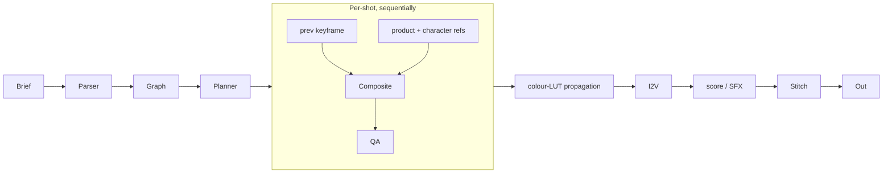

# Extensions

Two kinds of extension to document:

1. **Adding a model from a new provider** (Runway, Pika, Luma, any future
   vendor). The fast, one-file change.
2. **Covering the other three jewellery-ad types** — lifestyle, short-form
   social, narrative. The deeper architectural extensions.

---

## 0. Adding a new provider (one file, zero dispatch changes)

AI is a fast-moving industry. The pipeline is designed so that adding a new
image or video model means writing one file and importing it — no edits to
dispatch, config, or UI.

### The contract

Every provider is described by a `Provider` (pure data) and implemented
by a `FrameBackend` or `VideoBackend` (Protocol). See
[`pipeline/providers/registry.py`](../pipeline/providers/registry.py).

```python
class FrameBackend(Protocol):
    model: str
    def generate(self, request: FrameRequest) -> FrameResult: ...

class VideoBackend(Protocol):
    model: str
    def generate(self, request: VideoRequest) -> VideoResult: ...
```

### Example: add Runway Gen-4 video

Create `pipeline/providers/runway.py`:

```python
from .registry import Provider, ProviderKind, VideoRequest, VideoResult, registry
import runway_sdk   # hypothetical


class RunwayGen4Backend:
    def __init__(self, provider: Provider, env: dict[str, str]):
        self.provider = provider
        self.model = provider.id
        self._client = runway_sdk.Client(api_key=env["RUNWAY_API_KEY"])

    def generate(self, request: VideoRequest) -> VideoResult:
        # Translate our canonical VideoRequest into Runway's API,
        # call it, download the MP4 to request.out_path.
        ...
        return VideoResult(clip_path=request.out_path, model=self.model)


registry.register_backend(
    "runway",
    lambda provider, env: RunwayGen4Backend(provider, env),
)

for model_id, price in [
    ("runway/gen-4-turbo",     0.50),
    ("runway/gen-4-standard",  1.20),
]:
    registry.register_provider(Provider(
        id=model_id,
        kind=ProviderKind.VIDEO,
        backend="runway",
        unit="clip",
        unit_cost_usd=price,
        requires_env=["RUNWAY_API_KEY"],
        display_name=f"Runway {model_id.split('/')[1]}",
        tags=["runway"],
    ))
```

Then add one line to `pipeline/providers/__init__.py`:

```python
from . import runway  # noqa: F401
```

**Done.** That's the entire change. Everything below picks up automatically:

- UI dropdown populates via `GET /api/config` → `video_providers` list
- Live cost estimate uses the declared `unit_cost_usd`
- Dispatch in `pipeline/run.py` is `registry.build(cfg.video_model, kind=..., env=...)` — no string prefix checks, no if/elif
- Missing `RUNWAY_API_KEY` fails fast with a clear error: *"provider 'runway/gen-4-turbo' requires env var(s): ['RUNWAY_API_KEY']"*
- `/api/config` reports `"env_ready": false` when `RUNWAY_API_KEY` isn't set, so the UI can grey out the option

### What *not* to touch when adding a provider

None of the following need edits:

- [`pipeline/run.py`](../pipeline/run.py) — dispatch is data-driven
- [`pipeline/config.py`](../pipeline/config.py) — no hardcoded model lists
- [`pipeline/frame_gen.py`](../pipeline/frame_gen.py) / [`video_gen.py`](../pipeline/video_gen.py) — they take a `Backend` protocol
- [`server/main.py`](../server/main.py) — `/api/config` reads the registry
- [`server/web/app.js`](../server/web/app.js) — dropdowns consume the API response

### Adding a brand-new *kind* (e.g. audio/music)

Rarer. Add a new `ProviderKind` enum value, a new `Backend` Protocol +
`Request`/`Result` types in `registry.py`, a new orchestrator module (like
`frame_gen.py` or `video_gen.py`), and wire it into the run orchestrator.
Three files instead of one, but the pattern stays the same.

---

## 1. Lifestyle

**What it adds on top of CGI:** a human subject, consistent across shots.

**What stays the same:**

- `ShotGraph` schema (with a new field, see below).
- Brief parser, planner, QA loop, video gen, stitcher.

**What changes:**

1. **Add `identity/character.py`** — implements `IdentityModule` with a
   reference portrait. Candidate backends: IP-Adapter Face / PuLID (local
   SDXL), or Flux.1 Redux with a portrait reference, or Runway Act-One for
   controllable characters.

2. **Introduce `CompositeIdentity`** — given `ProductIdentity` and
   `CharacterIdentity`, generate a frame with both subjects preserved. The
   cleanest way is two-pass: generate the character scene first with a
   "wearing [placeholder]" prompt, then inpaint the product region using
   `ProductIdentity`. Both modules already exist; the composite is ~80 lines
   of orchestration.

3. **Extend `ShotGraph.product` -> `ShotGraph.subjects`** — list of
   `SubjectRef` (product, character, extra props). The planner composes
   prompts from the full subject list. Backwards-compatible with a migration.

4. **Extend QA** — add a face-similarity gate alongside product fidelity.
   ArcFace embeddings are the standard choice here. Same retry loop structure.

5. **Brief parser system prompt** — tell the LLM lifestyle is in play so it
   writes scenes with human action (morning routine, dinner, walking),
   emotional beats, and cloth/skin rendering hints.

**Estimated additional work beyond CGI pipeline:** 1.5-2 days. The expensive
part is making the character identity survive across 4 shots; the product
identity machinery we already have transfers directly.


---

## 2. Short-form social

**What it adds:** nothing new architecturally. It *removes* things.

**What stays the same:**

- Everything.

**What changes:**

1. **`--preset short-form` flag** — caps the planner at one shot, forces
   framing to `close_up` or `extreme_close_up`, caps duration at 10s.

2. **Skip the stitcher** — with one shot there is nothing to stitch; the
   single clip is the final output.

3. **Brief parser system prompt** — told to prioritise a single punchy beat,
   high motion, immediate visual impact, assume mobile viewing.

That's the whole extension. ~50 lines, half a day. The reason short-form
takes so little is that it's structurally a degenerate case of the CGI
pipeline.

---

## 3. Occasion-led narrative

**What it adds:** multi-scene consistency over 30-60 seconds with a
character arc, plus emotional cinematography.

**What stays the same:**

- `ShotGraph`, brief parser, planner, QA, stitcher.

**What changes:**

1. **Scene-to-scene conditioning.** The big architectural addition. The
   frame generator for shot N must consider the *previous* keyframe, not
   just the reference images. The cleanest way to add this is a
   `SequentialFrameGenerator` wrapper that, for shot N, constructs an
   `IdentityRequest` with `reference_image_path = keyframe[N-1]` alongside
   the canonical product + character refs. Most reference-conditioned models
   accept multiple images; Flux Kontext supports it natively.

2. **`ShotGraph.sequence` metadata** — explicit graph of narrative beats
   (setup, tension, reveal, resolution). The planner uses this to shape
   framing and camera choices per beat.

3. **Lighting continuity module.** Optional but high-impact. Extract a
   colour LUT from the first successful keyframe and apply it as a post
   step to subsequent keyframes *before* I2V. Prevents palette drift across
   a 60-second sequence. ~100 lines with `colour-science` + PIL.

4. **Music/SFX stage** — becomes meaningful at this length. A `score.py`
   stage between video gen and stitch would call Suno or ElevenLabs SFX
   and mix in ffmpeg. Explicitly out of scope for the CGI demo.

5. **QA expansion.** Add a "style consistency" gate: CLIP similarity between
   consecutive keyframes must stay above a floor to catch palette drift.

**Estimated additional work beyond lifestyle pipeline:** 2-3 days. The hard
part is sequence-aware conditioning without the output looking like a slow
mutation of frame 1. This is the research-y part of the problem.



---

## Cross-cutting: what does NOT need to change

Listing these explicitly because they're the argument that the CGI pipeline
is the right subset to have built first:

- `ShotGraph` schema only grows (new optional fields); existing callers keep
  working.
- `IdentityModule` Protocol is unchanged; every extension adds
  implementations, not new interfaces.
- The six-stage pipeline shape is unchanged — stages are specialised or
  wrapped, not replaced.
- CLI structure — all extensions are `--preset` flags or `--identity`
  module swaps, not new commands.
- Cost accounting and QA loop — identical mechanisms, just with additional
  metrics per shot.

## The one thing that *might* need to change

If we ever want to do **story-long conditioning** (not just shot-N from
shot-N-1 but a persistent "world model" across a 2-minute film), we'd need
to introduce a persistent embedding / scene-memory module. That's the one
extension that's not a straightforward additive change — it reshapes how
the frame generator is conditioned. For the four ad types the assignment
names, we never quite need this, because even occasion-led narratives
top out at ~60 seconds with 6-8 shots. Sequential pairwise conditioning
is enough.
